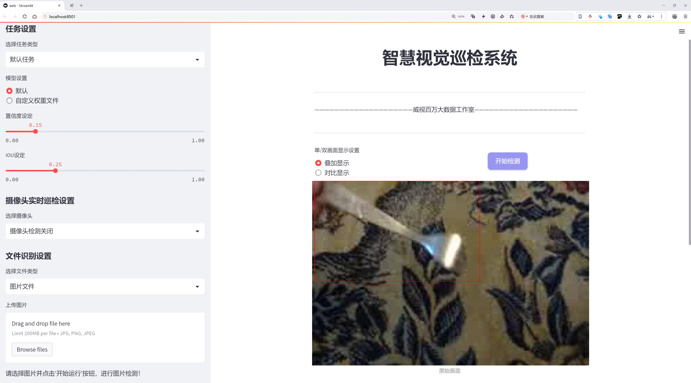
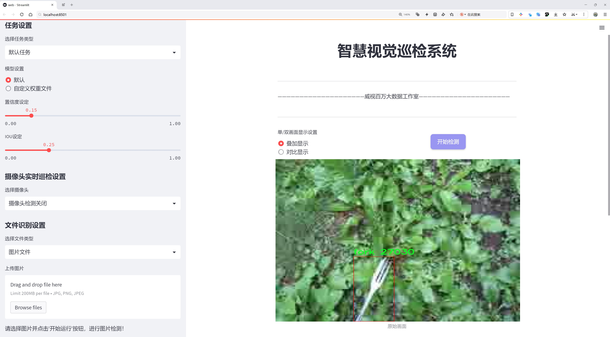
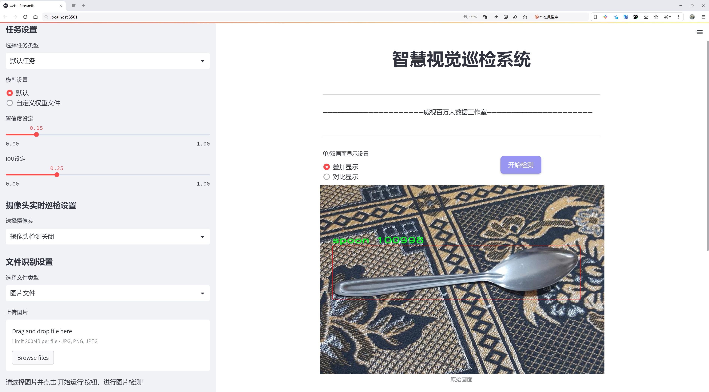
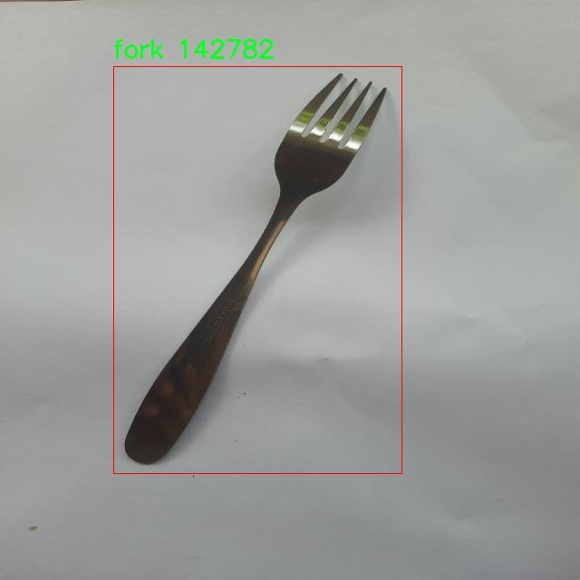
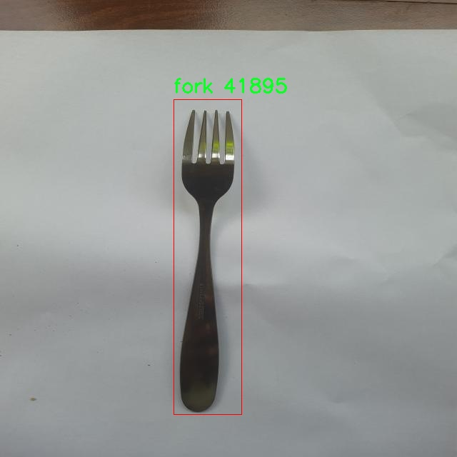
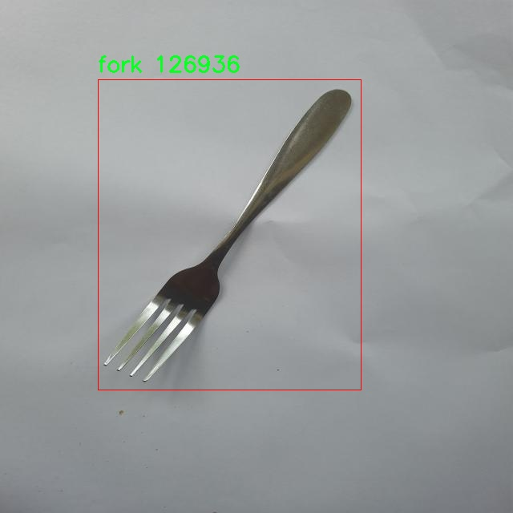
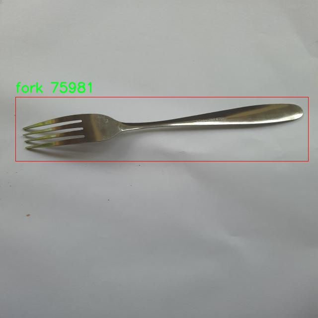
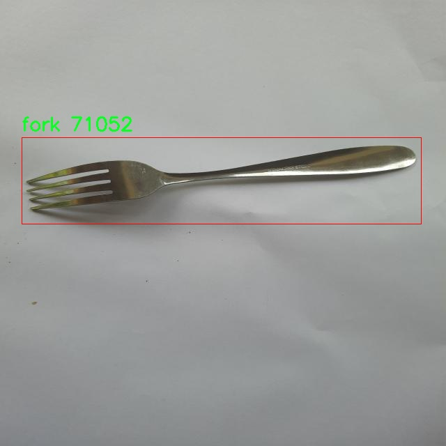

# 餐具分类检测检测系统源码分享
 # [一条龙教学YOLOV8标注好的数据集一键训练_70+全套改进创新点发刊_Web前端展示]

### 1.研究背景与意义

项目参考[AAAI Association for the Advancement of Artificial Intelligence](https://gitee.com/qunshansj/projects)

项目来源[AACV Association for the Advancement of Computer Vision](https://gitee.com/qunmasj/projects)

研究背景与意义

随着社会的不断发展和生活水平的提高，餐饮行业的蓬勃发展催生了对餐具管理和分类的迫切需求。餐具作为餐饮服务中不可或缺的组成部分，其种类繁多、形态各异，如何高效、准确地对餐具进行分类和检测，成为了餐饮行业自动化和智能化发展的重要课题。传统的人工分类方法不仅耗时耗力，而且容易出现错误，难以满足现代餐饮业对效率和准确性的高要求。因此，基于计算机视觉的自动化餐具分类检测系统应运而生，成为解决这一问题的有效途径。

在众多计算机视觉技术中，YOLO（You Only Look Once）系列模型因其实时性和高精度而备受关注。YOLOv8作为该系列的最新版本，结合了深度学习和卷积神经网络的优势，能够在复杂环境中快速、准确地进行物体检测。通过对YOLOv8模型的改进，可以进一步提升其在餐具分类检测中的性能，尤其是在处理多类别、多样化餐具时的鲁棒性和准确性。基于YOLOv8的餐具分类检测系统，不仅能够实现对餐具的快速识别，还能为餐饮行业的智能化管理提供有力支持。

本研究选用的“final tableware sorting”数据集包含3600张图像，涵盖了叉子、刀子、盘子和勺子四个类别。该数据集的多样性和丰富性为模型的训练和测试提供了良好的基础。通过对这些图像的深入分析，可以提取出餐具的特征信息，进而优化YOLOv8模型的参数设置和结构设计，使其在餐具分类检测中达到更高的准确率和更快的响应速度。此外，数据集中不同类别餐具的图像数量相对均衡，能够有效避免模型在训练过程中出现偏差，确保分类结果的公正性和可靠性。

本研究的意义不仅在于技术层面的创新，更在于推动餐饮行业的智能化转型。通过构建基于改进YOLOv8的餐具分类检测系统，可以为餐饮企业提供高效的餐具管理解决方案，降低人工成本，提高工作效率。同时，该系统的成功应用将为其他领域的物体检测提供借鉴，促进计算机视觉技术的广泛应用和发展。

综上所述，基于改进YOLOv8的餐具分类检测系统的研究，不仅具有重要的理论价值，还有着广泛的实际应用前景。通过本研究的深入探索，期望能够为餐饮行业的智能化发展提供新的思路和方法，为实现更高效的餐具管理和服务质量提升贡献力量。

### 2.图片演示







##### 注意：由于此博客编辑较早，上面“2.图片演示”和“3.视频演示”展示的系统图片或者视频可能为老版本，新版本在老版本的基础上升级如下：（实际效果以升级的新版本为准）

  （1）适配了YOLOV8的“目标检测”模型和“实例分割”模型，通过加载相应的权重（.pt）文件即可自适应加载模型。

  （2）支持“图片识别”、“视频识别”、“摄像头实时识别”三种识别模式。

  （3）支持“图片识别”、“视频识别”、“摄像头实时识别”三种识别结果保存导出，解决手动导出（容易卡顿出现爆内存）存在的问题，识别完自动保存结果并导出到tempDir中。

  （4）支持Web前端系统中的标题、背景图等自定义修改，后面提供修改教程。

  另外本项目提供训练的数据集和训练教程,暂不提供权重文件（best.pt）,需要您按照教程进行训练后实现图片演示和Web前端界面演示的效果。

### 3.视频演示

[3.1 视频演示](https://www.bilibili.com/video/BV1HE4depExb/)

### 4.数据集信息展示

##### 4.1 本项目数据集详细数据（类别数＆类别名）

nc: 4
names: ['fork', 'knife', 'plate', 'spoon']


##### 4.2 本项目数据集信息介绍

数据集信息展示

在现代计算机视觉领域，数据集的构建与应用是推动深度学习模型发展的重要基础。本研究所采用的数据集名为“final tableware sorting”，旨在为改进YOLOv8的餐具分类检测系统提供丰富的训练样本和标注信息。该数据集专注于餐具的自动识别与分类，具有重要的实际应用价值，尤其是在智能厨房、餐饮服务及自动化清洗等领域。

“final tableware sorting”数据集包含四个主要类别，分别是叉子（fork）、刀子（knife）、盘子（plate）和勺子（spoon）。这些类别的选择不仅考虑了餐具的常见性，还反映了日常生活中餐具的多样性与功能性。每个类别都具有独特的形状、颜色和材质特征，这为模型的训练提供了丰富的样本变异性，有助于提高分类的准确性和鲁棒性。

在数据集的构建过程中，研究团队收集了大量的餐具图像，确保每个类别都有足够的样本量以支持深度学习模型的训练。图像的采集环境经过精心设计，涵盖了不同的光照条件、背景设置和拍摄角度，以模拟真实场景中的多样性。这种多样化的图像来源不仅提高了模型的泛化能力，还增强了其在不同环境下的适应性。

数据集中的每张图像都经过精确的标注，确保模型在训练过程中能够学习到每个类别的特征。标注信息包括餐具的边界框和类别标签，这些信息对于YOLOv8模型的训练至关重要。通过这种方式，模型能够有效地学习到不同餐具的空间分布和视觉特征，从而在实际应用中实现高效的分类与检测。

此外，为了进一步提升模型的性能，数据集还进行了数据增强处理。通过旋转、缩放、翻转等多种方式，研究团队生成了多样化的训练样本，以增加模型的鲁棒性。这种数据增强技术不仅可以防止模型过拟合，还能提高其在面对新样本时的识别能力。

“final tableware sorting”数据集的构建与应用，标志着餐具分类检测领域的一个重要进展。通过使用该数据集，研究者们能够有效地训练和优化YOLOv8模型，使其在餐具识别任务中表现出色。未来，随着数据集的不断扩展和更新，预计将会有更多的餐具类别被纳入其中，从而进一步提升模型的分类能力和应用范围。

总之，“final tableware sorting”数据集不仅为改进YOLOv8的餐具分类检测系统提供了坚实的基础，也为相关领域的研究与应用开辟了新的方向。通过深入的研究与探索，期待该数据集能够为智能餐饮服务和自动化厨房的实现贡献更多的力量。











### 5.全套项目环境部署视频教程（零基础手把手教学）

[5.1 环境部署教程链接（零基础手把手教学）](https://www.ixigua.com/7404473917358506534?logTag=c807d0cbc21c0ef59de5)


[5.2 安装Python虚拟环境创建和依赖库安装视频教程链接（零基础手把手教学）](https://www.ixigua.com/7404474678003106304?logTag=1f1041108cd1f708b01a)

### 6.手把手YOLOV8训练视频教程（零基础小白有手就能学会）

[6.1 手把手YOLOV8训练视频教程（零基础小白有手就能学会）](https://www.ixigua.com/7404477157818401292?logTag=d31a2dfd1983c9668658)

### 7.70+种全套YOLOV8创新点代码加载调参视频教程（一键加载写好的改进模型的配置文件）

[7.1 70+种全套YOLOV8创新点代码加载调参视频教程（一键加载写好的改进模型的配置文件）](https://www.ixigua.com/7404478314661806627?logTag=29066f8288e3f4eea3a4)

### 8.70+种全套YOLOV8创新点原理讲解（非科班也可以轻松写刊发刊，V10版本正在科研待更新）

由于篇幅限制，每个创新点的具体原理讲解就不一一展开，具体见下列网址中的创新点对应子项目的技术原理博客网址【Blog】：


[8.1 70+种全套YOLOV8创新点原理讲解链接](https://gitee.com/qunmasj/good)

### 9.系统功能展示（检测对象为举例，实际内容以本项目数据集为准）

图9.1.系统支持检测结果表格显示

  图9.2.系统支持置信度和IOU阈值手动调节

  图9.3.系统支持自定义加载权重文件best.pt(需要你通过步骤5中训练获得)

  图9.4.系统支持摄像头实时识别

  图9.5.系统支持图片识别

  图9.6.系统支持视频识别

  图9.7.系统支持识别结果文件自动保存

  图9.8.系统支持Excel导出检测结果数据


### 10.原始YOLOV8算法原理

原始YOLOv8算法原理

YOLOv8，作为2023年1月10日推出的最新目标检测模型，标志着计算机视觉领域的又一次重大突破。它不仅在精度和执行时间上超越了前代模型，还在多种应用场景中展现出其卓越的性能。YOLOv8的设计灵感来源于其前身YOLOv5、YOLOv6和YOLOX等模型，综合了这些模型的优点，并在此基础上进行了全面的结构优化和功能增强。该模型的出现，意味着目标检测与实例分割任务的技术水平进入了一个新的高度。

YOLOv8的核心架构由输入层、主干网络、颈部网络和头部网络四个主要部分构成。输入层负责将原始图像缩放至指定尺寸，以适应后续的处理需求。主干网络是YOLOv8的特征提取引擎，通过一系列卷积操作对输入图像进行下采样，提取出丰富的特征信息。每个卷积层都包含批归一化和SiLU激活函数，这不仅加速了训练过程，还提高了模型的非线性表达能力。

在主干网络中，YOLOv8引入了C2f模块，这一模块借鉴了YOLOv7中的E-ELAN结构，采用跨层分支连接的方式来增强模型的梯度流。这种设计使得特征提取更加高效，能够更好地捕捉到图像中的细节信息。此外，主干网络的末尾采用了SPPF模块，通过三个最大池化层处理多尺度特征，进一步提升了网络的特征抽象能力。

颈部网络则是YOLOv8中一个重要的创新部分。它采用了PAN-FPN结构，这种结构通过融合不同尺度的特征图信息，使得模型在处理多尺度目标时表现得更加出色。颈部网络的设计旨在将主干网络提取的特征进行有效整合，并将其传递给头部网络，以便进行最终的目标检测和分类。

YOLOv8的头部网络是其创新的又一亮点。与YOLOv5的耦合检测头不同，YOLOv8采用了解耦的检测头结构。这一结构将目标检测任务分为两个并行的卷积分支，分别计算回归和分类的损失。这种解耦设计不仅简化了模型的结构，还提高了检测的精度和效率。此外，YOLOv8采用了Anchor-Free的检测方式，摒弃了传统的Anchor-Based方法，减少了模型的复杂性，使得在不同场景下的适应性更强。

在损失函数的设计上，YOLOv8引入了新的损失函数CloU，这一损失函数在训练过程中能够更好地平衡回归和分类的任务，从而提升模型的整体性能。YOLOv8的这些创新设计，使得它在小目标检测和高分辨率图像处理方面展现出强大的能力，进一步拓宽了其应用领域。

值得一提的是，YOLOv8的设计不仅关注模型的性能，还兼顾了工程化的简洁性和易用性。这使得YOLOv8在实际应用中能够快速部署，适应各种硬件平台，从CPU到GPU都能高效运行。这一特性对于需要实时处理的应用场景尤为重要，例如自动驾驶、安防监控和智能制造等领域。

在实验结果方面，YOLOv8在COCOVal2017数据集上的表现尤为突出。与YOLOv5相比，YOLOv8在每张图像的识别准确性和训练速度上均取得了显著的提升，进一步验证了其在目标检测领域的领先地位。这一切都表明，YOLOv8不仅是YOLO系列模型的延续，更是目标检测技术的一次质的飞跃。

总的来说，YOLOv8的推出为计算机视觉领域带来了新的可能性。其在模型结构、特征提取、损失函数等多个方面的创新，充分展示了现代深度学习技术的强大潜力。随着YOLOv8的广泛应用，未来在目标检测、实例分割等任务中，我们有理由相信，它将继续推动这一领域的发展，为更多实际应用提供支持。


### 11.项目核心源码讲解（再也不用担心看不懂代码逻辑）

#### 11.1 code\ultralytics\models\yolo\classify\predict.py

以下是经过简化和注释的核心代码部分，保留了最重要的功能，并对每个部分进行了详细的中文注释：

```python
# 导入必要的库
import cv2
import torch
from PIL import Image
from ultralytics.engine.predictor import BasePredictor
from ultralytics.engine.results import Results
from ultralytics.utils import DEFAULT_CFG, ops

class ClassificationPredictor(BasePredictor):
    """
    继承自 BasePredictor 类，用于基于分类模型的预测。
    """

    def __init__(self, cfg=DEFAULT_CFG, overrides=None, _callbacks=None):
        """初始化 ClassificationPredictor，将任务设置为 'classify'."""
        super().__init__(cfg, overrides, _callbacks)  # 调用父类构造函数
        self.args.task = "classify"  # 设置任务类型为分类
        self._legacy_transform_name = "ultralytics.yolo.data.augment.ToTensor"  # 旧版转换名称

    def preprocess(self, img):
        """将输入图像转换为模型兼容的数据类型."""
        # 检查输入是否为张量
        if not isinstance(img, torch.Tensor):
            # 检查是否使用旧版转换
            is_legacy_transform = any(
                self._legacy_transform_name in str(transform) for transform in self.transforms.transforms
            )
            if is_legacy_transform:  # 处理旧版转换
                img = torch.stack([self.transforms(im) for im in img], dim=0)
            else:
                # 将图像从 BGR 转换为 RGB，并应用转换
                img = torch.stack(
                    [self.transforms(Image.fromarray(cv2.cvtColor(im, cv2.COLOR_BGR2RGB))) for im in img], dim=0
                )
        # 将图像转换为模型所需的设备类型
        img = (img if isinstance(img, torch.Tensor) else torch.from_numpy(img)).to(self.model.device)
        # 根据模型是否使用 fp16 转换数据类型
        return img.half() if self.model.fp16 else img.float()  # uint8 转换为 fp16/32

    def postprocess(self, preds, img, orig_imgs):
        """对预测结果进行后处理，返回 Results 对象."""
        # 如果输入图像不是列表，则转换为 numpy 数组
        if not isinstance(orig_imgs, list):  
            orig_imgs = ops.convert_torch2numpy_batch(orig_imgs)

        results = []  # 存储结果的列表
        for i, pred in enumerate(preds):
            orig_img = orig_imgs[i]  # 获取原始图像
            img_path = self.batch[0][i]  # 获取图像路径
            # 将结果添加到结果列表中
            results.append(Results(orig_img, path=img_path, names=self.model.names, probs=pred))
        return results  # 返回处理后的结果
```

### 代码分析：
1. **导入库**：引入了处理图像和张量的必要库。
2. **ClassificationPredictor 类**：该类继承自 `BasePredictor`，用于分类任务的预测。
3. **初始化方法**：设置任务类型为分类，并处理旧版转换的名称。
4. **预处理方法**：将输入图像转换为模型可以接受的格式，包括处理旧版转换和设备转换。
5. **后处理方法**：将模型的预测结果转换为 `Results` 对象，便于后续使用。

这段代码的核心功能是图像分类的预处理和后处理，确保输入图像能够被模型正确处理，并将预测结果整理成可用的格式。

这个文件是Ultralytics YOLO（You Only Look Once）模型的一部分，主要用于图像分类的预测。它定义了一个名为`ClassificationPredictor`的类，该类继承自`BasePredictor`，用于处理图像分类任务。

在文件的开头，导入了一些必要的库，包括OpenCV（用于图像处理）、PyTorch（用于深度学习）和PIL（用于图像操作）。接着，导入了Ultralytics的预测器和结果处理模块。

`ClassificationPredictor`类的构造函数`__init__`初始化了分类预测器，并将任务类型设置为“classify”。它还处理了一些配置参数和回调函数，确保预测器能够正确运行。

`preprocess`方法负责对输入图像进行预处理，以便将其转换为模型所需的数据格式。该方法首先检查输入是否为PyTorch张量，如果不是，则根据是否使用了旧版转换方法进行处理。它将图像转换为RGB格式，并使用预定义的转换函数进行处理。最后，图像被转换为适合模型的类型（半精度或单精度浮点数），并移动到模型所在的设备上。

`postprocess`方法用于对模型的预测结果进行后处理，返回一个包含结果的对象列表。该方法首先检查原始图像是否为列表，如果不是，则将其转换为NumPy数组。然后，对于每个预测结果，它将原始图像、图像路径、模型名称和预测概率打包成一个`Results`对象，并将其添加到结果列表中。

总的来说，这个文件实现了图像分类的预测功能，包括输入图像的预处理和输出结果的后处理，方便用户使用YOLO模型进行分类任务。

#### 11.2 ui.py

以下是代码中最核心的部分，并附上详细的中文注释：

```python
import sys
import subprocess

def run_script(script_path):
    """
    使用当前 Python 环境运行指定的脚本。

    Args:
        script_path (str): 要运行的脚本路径

    Returns:
        None
    """
    # 获取当前 Python 解释器的路径
    python_path = sys.executable

    # 构建运行命令，使用 streamlit 运行指定的脚本
    command = f'"{python_path}" -m streamlit run "{script_path}"'

    # 执行命令，并等待其完成
    result = subprocess.run(command, shell=True)
    
    # 检查命令执行的返回码，如果不为0则表示出错
    if result.returncode != 0:
        print("脚本运行出错。")

# 实例化并运行应用
if __name__ == "__main__":
    # 指定要运行的脚本路径
    script_path = "web.py"  # 这里可以替换为实际的脚本路径

    # 调用函数运行指定的脚本
    run_script(script_path)
```

### 注释说明：
1. **导入模块**：
   - `sys`：用于获取当前 Python 解释器的路径。
   - `subprocess`：用于执行外部命令。

2. **`run_script` 函数**：
   - 该函数接收一个脚本路径作为参数，并使用当前 Python 环境运行该脚本。
   - 使用 `sys.executable` 获取当前 Python 解释器的路径，以确保脚本在正确的环境中运行。
   - 使用 `subprocess.run` 执行构建的命令，并等待其完成。

3. **错误处理**：
   - 检查命令的返回码，如果返回码不为0，表示脚本运行出错，并打印错误信息。

4. **主程序入口**：
   - 使用 `if __name__ == "__main__":` 确保该代码块仅在直接运行该脚本时执行。
   - 指定要运行的脚本路径，并调用 `run_script` 函数来执行该脚本。

这个程序文件名为 `ui.py`，主要功能是通过当前的 Python 环境来运行一个指定的脚本，具体是一个名为 `web.py` 的文件。程序首先导入了必要的模块，包括 `sys`、`os` 和 `subprocess`，以及一个自定义的路径处理函数 `abs_path`，这个函数来自于 `QtFusion.path` 模块。

在 `run_script` 函数中，程序接收一个参数 `script_path`，这个参数是要运行的脚本的路径。函数首先获取当前 Python 解释器的路径，并将其存储在 `python_path` 变量中。接着，程序构建了一个命令字符串，这个命令使用 `streamlit` 模块来运行指定的脚本。具体的命令格式是：`"{python_path}" -m streamlit run "{script_path}"`，其中 `"{python_path}"` 和 `"{script_path}"` 分别被替换为当前 Python 解释器的路径和要运行的脚本的路径。

随后，程序使用 `subprocess.run` 方法来执行这个命令。这个方法会在一个新的 shell 中运行命令，并等待其完成。如果命令执行的返回码不为零，表示脚本运行出错，程序会打印出相应的错误信息。

在文件的最后部分，程序通过 `if __name__ == "__main__":` 判断是否是直接运行该脚本。如果是，程序会调用 `abs_path` 函数来获取 `web.py` 的绝对路径，并将其传递给 `run_script` 函数，从而启动该脚本的执行。这样，整个程序的结构清晰，功能明确，能够方便地运行指定的 Python 脚本。

#### 11.3 code\ultralytics\models\yolo\segment\val.py

以下是经过简化和注释的核心代码部分：

```python
import torch
import torch.nn.functional as F
from ultralytics.utils import ops
from ultralytics.utils.metrics import SegmentMetrics, box_iou, mask_iou
from ultralytics.utils.plotting import output_to_target, plot_images

class SegmentationValidator:
    """
    该类用于基于分割模型的验证，继承自DetectionValidator。
    """

    def __init__(self, dataloader=None, save_dir=None, args=None):
        """初始化SegmentationValidator，设置任务为'segment'，并初始化评估指标。"""
        self.dataloader = dataloader  # 数据加载器
        self.save_dir = save_dir  # 保存目录
        self.args = args  # 参数
        self.metrics = SegmentMetrics(save_dir=self.save_dir)  # 初始化分割指标
        self.plot_masks = []  # 用于存储绘图的掩码

    def preprocess(self, batch):
        """预处理批次数据，将掩码转换为浮点型并发送到设备。"""
        batch["masks"] = batch["masks"].to(self.device).float()  # 将掩码转移到设备并转换为浮点型
        return batch

    def postprocess(self, preds):
        """后处理YOLO预测，返回输出检测结果和原型。"""
        p = ops.non_max_suppression(
            preds[0],
            self.args.conf,
            self.args.iou,
            multi_label=True,
            max_det=self.args.max_det,
        )
        proto = preds[1][-1] if len(preds[1]) == 3 else preds[1]  # 获取原型
        return p, proto

    def update_metrics(self, preds, batch):
        """更新评估指标。"""
        for si, (pred, proto) in enumerate(zip(preds[0], preds[1])):
            npr = len(pred)  # 当前预测数量
            pbatch = self._prepare_batch(si, batch)  # 准备批次数据
            gt_masks = pbatch.pop("masks")  # 获取真实掩码
            predn, pred_masks = self._prepare_pred(pred, pbatch, proto)  # 准备预测数据

            # 计算指标
            if npr > 0:
                stat = self._process_batch(predn, pbatch["bbox"], pbatch["cls"], pred_masks, gt_masks)
                self.stats["tp"].append(stat["tp"])  # 更新真正例
                self.stats["conf"].append(predn[:, 4])  # 更新置信度

    def _process_batch(self, detections, gt_bboxes, gt_cls, pred_masks=None, gt_masks=None):
        """
        处理批次，返回正确预测矩阵。
        """
        iou = mask_iou(gt_masks.view(gt_masks.shape[0], -1), pred_masks.view(pred_masks.shape[0], -1)) if pred_masks is not None else box_iou(gt_bboxes, detections[:, :4])
        return self.match_predictions(detections[:, 5], gt_cls, iou)  # 匹配预测和真实标签

    def plot_predictions(self, batch, preds, ni):
        """绘制批次预测结果，包括掩码和边界框。"""
        plot_images(
            batch["img"],
            *output_to_target(preds[0], max_det=15),  # 绘制预测结果
            torch.cat(self.plot_masks, dim=0) if len(self.plot_masks) else self.plot_masks,
            paths=batch["im_file"],
            fname=self.save_dir / f"val_batch{ni}_pred.jpg",
        )
        self.plot_masks.clear()  # 清空绘图掩码

    def pred_to_json(self, predn, filename, pred_masks):
        """将预测结果保存为JSON格式。"""
        # 将掩码编码为RLE格式并保存结果
        # 省略具体实现
```

### 代码注释说明：
1. **类初始化**：`__init__`方法中初始化了数据加载器、保存目录和评估指标，设置了用于存储绘图掩码的列表。
2. **预处理**：`preprocess`方法将输入批次中的掩码转换为浮点型并转移到指定设备上。
3. **后处理**：`postprocess`方法对YOLO模型的预测结果进行非极大值抑制，并返回处理后的检测结果和原型。
4. **更新指标**：`update_metrics`方法在每个批次中更新评估指标，计算真正例和置信度。
5. **处理批次**：`_process_batch`方法计算预测与真实标签之间的交并比（IoU），并返回匹配结果。
6. **绘制预测结果**：`plot_predictions`方法用于绘制预测结果，包括图像、掩码和边界框。
7. **保存预测结果**：`pred_to_json`方法将预测结果保存为JSON格式，便于后续评估和分析。

这个程序文件是一个用于YOLO（You Only Look Once）模型的分割验证器，名为`SegmentationValidator`，它继承自`DetectionValidator`类。该类的主要功能是对分割模型的输出进行验证和评估，特别是在图像分割任务中。程序的结构和功能可以分为几个主要部分。

首先，文件导入了一些必要的库和模块，包括多线程处理、路径操作、NumPy、PyTorch及其功能模块等。这些库为后续的模型验证和数据处理提供了支持。

在`SegmentationValidator`类的构造函数中，初始化了一些参数，包括数据加载器、保存目录、进度条、参数和回调函数。此类将任务类型设置为“segment”，并初始化分割指标以便于后续的性能评估。

`preprocess`方法用于对输入批次进行预处理，主要是将掩码数据转换为浮点数并发送到指定的设备（如GPU）。`init_metrics`方法则初始化指标并根据是否保存JSON文件选择掩码处理函数。

在`get_desc`方法中，返回一个格式化的字符串，描述评估指标的各个方面，包括图像数量、实例数量、盒子和掩码的精度和召回率等。

`postprocess`方法对YOLO模型的预测结果进行后处理，返回输出检测结果和原型数据。`_prepare_batch`和`_prepare_pred`方法分别用于准备输入批次和预测结果，以便进行后续的处理和评估。

`update_metrics`方法是核心部分之一，它负责更新各种评估指标。它会遍历每个预测结果，准备批次数据，并根据真实标签和预测结果计算真阳性（TP）和其他统计信息。对于每个批次，掩码的处理和评估也在此进行。

`finalize_metrics`方法用于设置评估指标的速度和混淆矩阵。`_process_batch`方法则根据检测结果和真实标签计算正确预测的矩阵，支持掩码和边界框的评估。

在可视化方面，`plot_val_samples`和`plot_predictions`方法用于绘制验证样本和预测结果，帮助用户直观地理解模型的表现。

`pred_to_json`方法将预测结果保存为JSON格式，适用于COCO数据集的评估。它使用了RLE（Run-Length Encoding）对掩码进行编码，并将结果存储在字典中。

最后，`eval_json`方法用于评估模型的性能，特别是计算COCO风格的目标检测评估指标，包括mAP（mean Average Precision）。它会检查JSON文件的存在性，并使用pycocotools库进行评估。

总体而言，这个程序文件提供了一个完整的框架，用于验证YOLO分割模型的性能，涵盖了数据预处理、指标计算、结果可视化和性能评估等多个方面。

#### 11.4 70+种YOLOv8算法改进源码大全和调试加载训练教程（非必要）\ultralytics\models\sam\modules\encoders.py

以下是经过简化和注释的核心代码部分，主要保留了 `ImageEncoderViT` 和 `PatchEmbed` 类，以及它们的关键方法。注释详细解释了每个部分的功能和作用。

```python
import torch
import torch.nn as nn
from typing import Optional, Tuple

class PatchEmbed(nn.Module):
    """将图像分割为补丁并进行嵌入的模块。"""

    def __init__(
            self,
            kernel_size: Tuple[int, int] = (16, 16),  # 卷积核大小
            stride: Tuple[int, int] = (16, 16),       # 步幅
            in_chans: int = 3,                        # 输入图像的通道数
            embed_dim: int = 768,                     # 嵌入维度
    ) -> None:
        """初始化PatchEmbed模块。"""
        super().__init__()
        # 使用卷积层将图像转换为补丁嵌入
        self.proj = nn.Conv2d(in_chans, embed_dim, kernel_size=kernel_size, stride=stride)

    def forward(self, x: torch.Tensor) -> torch.Tensor:
        """计算补丁嵌入，通过卷积并转置结果张量。"""
        return self.proj(x).permute(0, 2, 3, 1)  # 将输出从 (B, C, H, W) 转换为 (B, H, W, C)


class ImageEncoderViT(nn.Module):
    """
    使用视觉变换器（ViT）架构对图像进行编码的模块。
    将图像分割为补丁，并通过一系列变换块处理这些补丁。
    """

    def __init__(
            self,
            img_size: int = 1024,                     # 输入图像的大小
            patch_size: int = 16,                     # 每个补丁的大小
            in_chans: int = 3,                        # 输入图像的通道数
            embed_dim: int = 768,                     # 嵌入维度
            depth: int = 12,                          # ViT的深度（变换块的数量）
            out_chans: int = 256,                     # 输出通道数
    ) -> None:
        """初始化图像编码器。"""
        super().__init__()
        self.img_size = img_size

        # 初始化补丁嵌入模块
        self.patch_embed = PatchEmbed(
            kernel_size=(patch_size, patch_size),
            stride=(patch_size, patch_size),
            in_chans=in_chans,
            embed_dim=embed_dim,
        )

        # 初始化变换块
        self.blocks = nn.ModuleList()
        for _ in range(depth):
            block = Block(embed_dim)  # 假设Block类已定义
            self.blocks.append(block)

        # 初始化后续处理模块
        self.neck = nn.Sequential(
            nn.Conv2d(embed_dim, out_chans, kernel_size=1, bias=False),
            nn.LayerNorm(out_chans),
            nn.Conv2d(out_chans, out_chans, kernel_size=3, padding=1, bias=False),
            nn.LayerNorm(out_chans),
        )

    def forward(self, x: torch.Tensor) -> torch.Tensor:
        """处理输入图像，通过补丁嵌入、变换块和后续处理模块。"""
        x = self.patch_embed(x)  # 将图像转换为补丁嵌入
        for blk in self.blocks:   # 通过每个变换块处理嵌入
            x = blk(x)
        return self.neck(x.permute(0, 3, 1, 2))  # 转换维度并通过后续处理模块
```

### 代码说明：
1. **PatchEmbed 类**：
   - 该类负责将输入图像分割为固定大小的补丁，并将这些补丁嵌入到一个高维空间中。
   - 使用卷积层实现补丁的提取，输出的形状为 `(B, H, W, C)`。

2. **ImageEncoderViT 类**：
   - 该类实现了一个基于视觉变换器的图像编码器。
   - 初始化时，创建补丁嵌入模块和多个变换块。
   - 在 `forward` 方法中，首先将输入图像转换为补丁嵌入，然后通过每个变换块进行处理，最后通过后续处理模块生成最终的编码表示。

### 注意：
- `Block` 类的实现没有提供，假设它是一个已定义的变换块类，负责实现自注意力机制和前馈网络。

这个程序文件定义了一个用于图像编码的类 `ImageEncoderViT`，它基于视觉变换器（Vision Transformer, ViT）架构，将输入图像编码为紧凑的潜在空间表示。该编码器首先将图像分割成多个小块（patches），然后通过一系列的变换块（transformer blocks）处理这些小块，最后通过一个颈部模块（neck）生成最终的编码表示。

在 `ImageEncoderViT` 类的构造函数中，定义了一些重要的参数，包括输入图像的大小、每个小块的大小、输入通道数、嵌入维度、变换块的深度、注意力头的数量等。构造函数中还初始化了小块嵌入模块 `PatchEmbed`，用于将图像转换为小块嵌入。接着，如果启用了绝对位置嵌入，还会初始化一个位置嵌入参数。随后，构造函数会创建多个变换块，并将它们添加到模块列表中。最后，定义了一个颈部模块，该模块进一步处理输出以生成最终的编码表示。

`forward` 方法定义了前向传播的过程，首先通过小块嵌入模块处理输入图像，然后如果存在位置嵌入，则将其添加到嵌入中。接着，依次通过每个变换块进行处理，最后将结果传递给颈部模块，输出最终的编码结果。

文件中还定义了 `PromptEncoder` 类，用于编码不同类型的提示，包括点、框和掩码，以便输入到 SAM 的掩码解码器。该编码器生成稀疏和密集的嵌入，支持多种输入格式。构造函数中定义了嵌入维度、输入图像大小、图像嵌入大小等参数，并初始化了用于处理掩码的神经网络。

`PositionEmbeddingRandom` 类用于生成随机空间频率的位置信息，帮助模型理解输入数据的空间结构。`Block` 类和 `Attention` 类则实现了变换器的基本构建块，支持窗口注意力和残差传播。

整体而言，这个程序文件实现了一个复杂的图像编码架构，结合了现代深度学习中的多种技术，适用于计算机视觉任务中的图像特征提取和表示学习。

#### 11.5 train.py

以下是经过简化和注释的核心代码部分，主要保留了训练检测模型的核心逻辑和数据处理部分：

```python
import random
import numpy as np
import torch.nn as nn
from ultralytics.data import build_dataloader, build_yolo_dataset
from ultralytics.engine.trainer import BaseTrainer
from ultralytics.models import yolo
from ultralytics.nn.tasks import DetectionModel
from ultralytics.utils import LOGGER, RANK
from ultralytics.utils.torch_utils import de_parallel, torch_distributed_zero_first

class DetectionTrainer(BaseTrainer):
    """
    基于检测模型的训练类，继承自BaseTrainer类。
    """

    def build_dataset(self, img_path, mode="train", batch=None):
        """
        构建YOLO数据集。

        参数:
            img_path (str): 包含图像的文件夹路径。
            mode (str): 模式，可以是'train'或'val'，用于自定义不同的增强。
            batch (int, optional): 批次大小，仅用于'rect'模式。默认为None。
        """
        gs = max(int(de_parallel(self.model).stride.max() if self.model else 0), 32)  # 获取模型的最大步幅
        return build_yolo_dataset(self.args, img_path, batch, self.data, mode=mode, rect=mode == "val", stride=gs)

    def get_dataloader(self, dataset_path, batch_size=16, rank=0, mode="train"):
        """构建并返回数据加载器。"""
        assert mode in ["train", "val"]  # 确保模式有效
        with torch_distributed_zero_first(rank):  # 在分布式训练中，确保数据集只初始化一次
            dataset = self.build_dataset(dataset_path, mode, batch_size)
        shuffle = mode == "train"  # 训练模式下打乱数据
        workers = self.args.workers if mode == "train" else self.args.workers * 2  # 根据模式设置工作线程数
        return build_dataloader(dataset, batch_size, workers, shuffle, rank)  # 返回数据加载器

    def preprocess_batch(self, batch):
        """对图像批次进行预处理，包括缩放和转换为浮点数。"""
        batch["img"] = batch["img"].to(self.device, non_blocking=True).float() / 255  # 将图像转移到设备并归一化
        if self.args.multi_scale:  # 如果启用多尺度
            imgs = batch["img"]
            sz = (
                random.randrange(self.args.imgsz * 0.5, self.args.imgsz * 1.5 + self.stride)
                // self.stride
                * self.stride
            )  # 随机选择一个尺寸
            sf = sz / max(imgs.shape[2:])  # 计算缩放因子
            if sf != 1:
                ns = [
                    math.ceil(x * sf / self.stride) * self.stride for x in imgs.shape[2:]
                ]  # 计算新的形状
                imgs = nn.functional.interpolate(imgs, size=ns, mode="bilinear", align_corners=False)  # 进行插值缩放
            batch["img"] = imgs  # 更新批次图像
        return batch

    def get_model(self, cfg=None, weights=None, verbose=True):
        """返回YOLO检测模型。"""
        model = DetectionModel(cfg, nc=self.data["nc"], verbose=verbose and RANK == -1)  # 创建检测模型
        if weights:
            model.load(weights)  # 加载权重
        return model

    def plot_training_samples(self, batch, ni):
        """绘制带有注释的训练样本。"""
        plot_images(
            images=batch["img"],
            batch_idx=batch["batch_idx"],
            cls=batch["cls"].squeeze(-1),
            bboxes=batch["bboxes"],
            paths=batch["im_file"],
            fname=self.save_dir / f"train_batch{ni}.jpg",
            on_plot=self.on_plot,
        )
```

### 代码注释说明：
1. **类定义**：`DetectionTrainer` 类继承自 `BaseTrainer`，用于实现YOLO模型的训练。
2. **构建数据集**：`build_dataset` 方法用于构建YOLO数据集，接受图像路径、模式和批次大小作为参数。
3. **获取数据加载器**：`get_dataloader` 方法根据模式和批次大小返回数据加载器，支持分布式训练。
4. **预处理批次**：`preprocess_batch` 方法对输入的图像批次进行归一化和多尺度处理。
5. **获取模型**：`get_model` 方法创建并返回YOLO检测模型，支持加载预训练权重。
6. **绘制训练样本**：`plot_training_samples` 方法用于绘制训练样本及其对应的注释信息。 

通过这些核心部分和注释，可以更好地理解YOLO模型的训练过程及其数据处理逻辑。

这个程序文件 `train.py` 是一个用于训练 YOLO（You Only Look Once）目标检测模型的实现，基于 Ultralytics 提供的框架。程序中定义了一个 `DetectionTrainer` 类，该类继承自 `BaseTrainer`，专门用于处理目标检测任务。

在 `DetectionTrainer` 类中，首先定义了构建数据集的方法 `build_dataset`，该方法接受图像路径、模式（训练或验证）和批量大小作为参数。它使用 `build_yolo_dataset` 函数来创建 YOLO 数据集，并根据模型的步幅（stride）进行调整。

接下来，`get_dataloader` 方法用于构建并返回数据加载器。该方法会根据模式（训练或验证）初始化数据集，并设置是否打乱数据的顺序。对于训练模式，数据会被打乱，而在验证模式下则不会。

`preprocess_batch` 方法负责对图像批次进行预处理，包括将图像缩放到适当的大小并转换为浮点数格式。它还支持多尺度训练，通过随机选择图像大小来增强模型的鲁棒性。

`set_model_attributes` 方法用于设置模型的属性，包括类别数量和类别名称等，以确保模型能够正确处理数据集中的目标。

`get_model` 方法返回一个 YOLO 检测模型实例，并可选择加载预训练权重。`get_validator` 方法则返回一个用于模型验证的 `DetectionValidator` 实例，以便在训练过程中评估模型性能。

`label_loss_items` 方法用于返回带有标签的训练损失项字典，方便在训练过程中监控模型的学习情况。`progress_string` 方法返回一个格式化的字符串，显示训练进度，包括当前的 epoch、GPU 内存使用情况、损失值、实例数量和图像大小等信息。

此外，`plot_training_samples` 方法用于绘制训练样本及其标注，便于可视化训练过程中的数据。`plot_metrics` 和 `plot_training_labels` 方法则用于绘制训练过程中的指标和标签，帮助用户分析模型的表现。

总体来说，这个文件提供了一个完整的训练框架，涵盖了数据集构建、数据加载、模型训练、损失监控和结果可视化等多个方面，旨在帮助用户高效地训练 YOLO 目标检测模型。

#### 11.6 code\ultralytics\models\yolo\classify\train.py

以下是经过简化和注释的核心代码部分，主要保留了分类训练的关键逻辑：

```python
import torch
from ultralytics.data import ClassificationDataset, build_dataloader
from ultralytics.engine.trainer import BaseTrainer
from ultralytics.models import yolo
from ultralytics.nn.tasks import ClassificationModel
from ultralytics.utils import DEFAULT_CFG, LOGGER, RANK, colorstr
from ultralytics.utils.torch_utils import torch_distributed_zero_first

class ClassificationTrainer(BaseTrainer):
    """
    扩展自 BaseTrainer 类，用于基于分类模型的训练。
    """

    def __init__(self, cfg=DEFAULT_CFG, overrides=None, _callbacks=None):
        """初始化 ClassificationTrainer 对象，支持配置覆盖和回调函数。"""
        if overrides is None:
            overrides = {}
        overrides["task"] = "classify"  # 设置任务类型为分类
        if overrides.get("imgsz") is None:
            overrides["imgsz"] = 224  # 默认图像大小
        super().__init__(cfg, overrides, _callbacks)

    def set_model_attributes(self):
        """从加载的数据集中设置 YOLO 模型的类名。"""
        self.model.names = self.data["names"]

    def get_model(self, cfg=None, weights=None, verbose=True):
        """返回配置好的 PyTorch 分类模型。"""
        model = ClassificationModel(cfg, nc=self.data["nc"], verbose=verbose and RANK == -1)
        if weights:
            model.load(weights)  # 加载权重

        for m in model.modules():
            if not self.args.pretrained and hasattr(m, "reset_parameters"):
                m.reset_parameters()  # 重置参数
            if isinstance(m, torch.nn.Dropout) and self.args.dropout:
                m.p = self.args.dropout  # 设置 dropout 概率
        for p in model.parameters():
            p.requires_grad = True  # 设置为可训练
        return model

    def build_dataset(self, img_path, mode="train"):
        """根据图像路径和模式创建 ClassificationDataset 实例。"""
        return ClassificationDataset(root=img_path, args=self.args, augment=mode == "train", prefix=mode)

    def get_dataloader(self, dataset_path, batch_size=16, rank=0, mode="train"):
        """返回用于推理的 PyTorch DataLoader，包含图像预处理变换。"""
        with torch_distributed_zero_first(rank):  # 在分布式训练中只初始化一次数据集
            dataset = self.build_dataset(dataset_path, mode)

        loader = build_dataloader(dataset, batch_size, self.args.workers, rank=rank)
        return loader  # 返回数据加载器

    def preprocess_batch(self, batch):
        """预处理一批图像和类标签。"""
        batch["img"] = batch["img"].to(self.device)  # 将图像移动到设备
        batch["cls"] = batch["cls"].to(self.device)  # 将类标签移动到设备
        return batch

    def final_eval(self):
        """评估训练好的模型并保存验证结果。"""
        for f in self.last, self.best:
            if f.exists():
                if f is self.best:
                    LOGGER.info(f"\nValidating {f}...")
                    self.metrics = self.validator(model=f)  # 验证模型
                    self.metrics.pop("fitness", None)  # 移除不需要的指标
        LOGGER.info(f"Results saved to {colorstr('bold', self.save_dir)}")  # 输出结果保存路径
```

### 代码注释说明：
1. **导入必要的库**：引入 PyTorch 和 Ultralytics 相关模块，提供模型训练和数据处理功能。
2. **ClassificationTrainer 类**：继承自 `BaseTrainer`，用于分类任务的训练。
3. **初始化方法**：设置任务类型和图像大小，并调用父类初始化。
4. **设置模型属性**：从数据集中获取类名并设置到模型中。
5. **获取模型**：根据配置和权重加载分类模型，并设置模型参数为可训练。
6. **构建数据集**：根据给定路径和模式（训练/测试）创建数据集实例。
7. **获取数据加载器**：返回一个 PyTorch 数据加载器，用于批量加载和预处理数据。
8. **预处理批次**：将图像和类标签移动到指定设备（如 GPU）。
9. **最终评估**：对训练好的模型进行评估，并保存验证结果。

通过这些注释，可以更清晰地理解代码的结构和功能。

这个程序文件是用于训练基于YOLO（You Only Look Once）模型的分类任务的。它继承自`BaseTrainer`类，提供了一系列方法来设置模型、构建数据集、加载数据以及训练模型。

首先，文件导入了必要的库，包括PyTorch和Torchvision，以及Ultralytics库中的多个模块。这些模块负责数据处理、模型训练和结果可视化等功能。

`ClassificationTrainer`类是该文件的核心部分，它用于初始化和管理分类模型的训练过程。在初始化方法中，可以传入配置参数和回调函数，默认情况下，图像大小被设置为224像素。该类的一个重要方法是`set_model_attributes`，它用于从加载的数据集中设置YOLO模型的类名。

`get_model`方法返回一个配置好的PyTorch模型，支持加载预训练权重，并根据需要重置模型参数。`setup_model`方法则负责加载模型，可以从本地文件、Torchvision模型或Ultralytics资产中获取。

`build_dataset`方法创建一个分类数据集实例，`get_dataloader`方法返回一个PyTorch数据加载器，负责将数据集中的图像进行预处理并提供给模型。`preprocess_batch`方法则将图像和类别标签移动到指定的设备上（如GPU）。

在训练过程中，`progress_string`方法用于返回格式化的训练进度字符串，`get_validator`方法返回一个用于验证的实例。`label_loss_items`方法生成一个带有标签的损失字典，虽然对于分类任务来说，这个方法并不是必需的。

此外，`plot_metrics`方法用于从CSV文件中绘制训练指标，`final_eval`方法用于评估训练后的模型并保存验证结果。最后，`plot_training_samples`方法用于绘制带有注释的训练样本，以便于可视化训练过程。

整体来看，这个文件提供了一个完整的框架，用于训练YOLO模型进行图像分类任务，涵盖了从数据加载到模型评估的各个步骤。

### 12.系统整体结构（节选）

### 整体功能和构架概括

该项目是一个基于YOLO（You Only Look Once）模型的计算机视觉框架，主要用于目标检测、图像分类和图像分割等任务。项目的结构清晰，包含多个模块，每个模块负责特定的功能，如数据处理、模型训练、预测、验证和结果可视化等。整体架构设计灵活，便于扩展和修改，支持多种YOLO模型的实现和改进。

以下是各个文件的功能整理：

| 文件路径                                                                                          | 功能描述                                                                                   |
|---------------------------------------------------------------------------------------------------|------------------------------------------------------------------------------------------|
| `code\ultralytics\models\yolo\classify\predict.py`                                               | 实现YOLO模型的图像分类预测，包括输入图像的预处理和输出结果的后处理。                     |
| `ui.py`                                                                                           | 通过命令行运行指定的Python脚本（如`web.py`），用于启动用户界面。                          |
| `code\ultralytics\models\yolo\segment\val.py`                                                   | 实现YOLO分割模型的验证功能，包括数据预处理、指标计算和结果可视化。                      |
| `70+种YOLOv8算法改进源码大全和调试加载训练教程（非必要）\ultralytics\models\sam\modules\encoders.py` | 定义图像编码器（如视觉变换器），用于处理输入图像并生成潜在表示，支持多种输入格式。        |
| `train.py`                                                                                       | 提供YOLO目标检测模型的训练框架，包括数据集构建、模型训练和结果监控。                     |
| `code\ultralytics\models\yolo\classify\train.py`                                                | 用于训练YOLO分类模型，包含数据加载、模型设置和训练过程的管理。                          |
| `code\utils.py`                                                                                  | 提供一些通用的工具函数，可能包括数据处理、模型评估等辅助功能。                           |
| `code\ultralytics\data\__init__.py`                                                              | 初始化数据模块，可能包含数据集和数据加载器的定义。                                      |
| `70+种YOLOv8算法改进源码大全和调试加载训练教程（非必要）\ultralytics\models\fastsam\model.py`      | 定义快速SAM（Segment Anything Model）模型的结构和功能，支持图像分割任务。               |
| `70+种YOLOv8算法改进源码大全和调试加载训练教程（非必要）\ultralytics\trackers\byte_tracker.py`  | 实现字节跟踪器，用于目标跟踪任务，可能结合YOLO模型进行实时跟踪。                          |
| `70+种YOLOv8算法改进源码大全和调试加载训练教程（非必要）\ultralytics\utils\patches.py`         | 提供一些补丁和修复功能，可能用于模型的兼容性和性能优化。                                 |
| `70+种YOLOv8算法改进源码大全和调试加载训练教程（非必要）\ultralytics\utils\benchmarks.py`      | 提供性能基准测试功能，用于评估模型的速度和准确性。                                       |
| `70+种YOLOv8算法改进源码大全和调试加载训练教程（非必要）\ultralytics\utils\metrics.py`         | 定义各种评估指标，用于模型性能的量化分析，包括准确率、召回率等。                         |

这个表格概述了项目中各个文件的主要功能，帮助理解整个框架的结构和各模块之间的关系。

注意：由于此博客编辑较早，上面“11.项目核心源码讲解（再也不用担心看不懂代码逻辑）”中部分代码可能会优化升级，仅供参考学习，完整“训练源码”、“Web前端界面”和“70+种创新点源码”以“13.完整训练+Web前端界面+70+种创新点源码、数据集获取”的内容为准。

### 13.完整训练+Web前端界面+70+种创新点源码、数据集获取


# [下载链接：https://mbd.pub/o/bread/ZpuWkplq](https://mbd.pub/o/bread/ZpuWkplq)